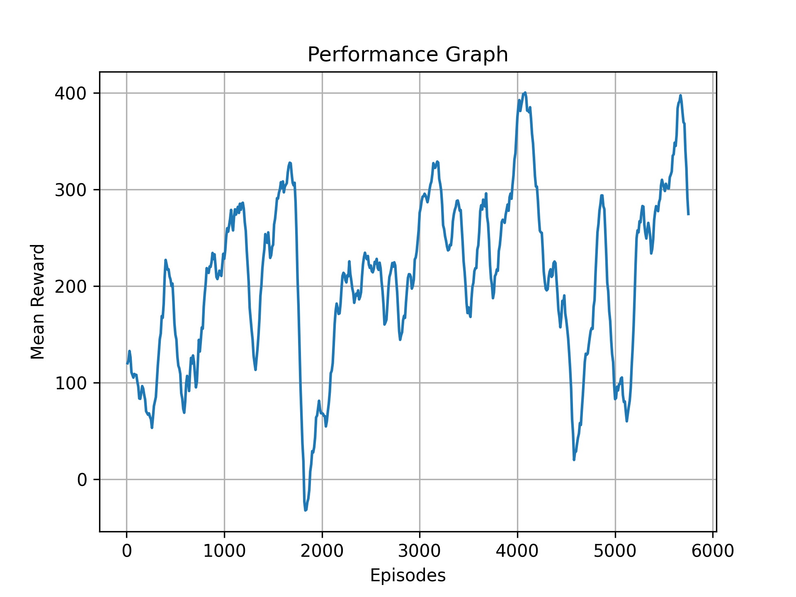

# Hollow-Knight-Neural-Network
A neural network model capable of playing Hollow Knight to defeat the Hornet Protector at Hall of Gods.

> **Fork note.** This fork extends the original PPO/Actor-Critic project with a **Behavior Cloning (BC) pipeline** that learns from recorded human demonstrations and benchmarks four additional model architectures (MLP, MLP_Temporal, CNN, GRU) against the live boss. The Reinforcement Learning (PPO) pipeline from upstream is kept intact and coexists with the new BC pipeline.

## Overview
This project combines a Unity mod to extract data from the game in real time with a Python-based AI model to fight the Hornet Protector boss. Two parallel pipelines are available:

- **Reinforcement Learning (RL / PPO)** — the original upstream approach. An Actor-Critic (Bernoulli policy + value head) is trained online inside the game using Proximal Policy Optimization with GAE.
- **Behavior Cloning (BC)** — added by this fork. A supervised learning model (MLP, MLP_Temporal, CNN, or GRU) is trained offline on recorded demonstrations (game telemetry + physical gamepad inputs), then runs against the live boss at inference time using a virtual gamepad.

Both pipelines share the same Unity data-extraction layer:

- **Data Extractor**: A Unity C# mod made with BepInEx that hooks C# code into the game. Inside the mod, a named pipe is opened to create a connection and extract game states.
- **Python**: Connects to the named pipe — either trains the RL model (`main.py`), records demonstrations (`main_extraction.py`), or runs a trained BC model and evaluates it (`main_tests.py`). Inputs are executed via the `vgamepad` library.

## Results

### RL (PPO) — original upstream results
- **Best mean reward**: 405.49
- Trained for **5758** episodes


<!--  -->



### BC (Behavior Cloning) benchmark
Aggregated from [`all_model_tests.csv`](all_model_tests.csv) — 60 evaluation runs over the four BC architectures, fought against the Hornet Protector in the Hall of Gods (15 runs per model, same arena hash `423158243`). Each fight is automatically logged by `TestLogger` (see [Evaluation Metrics](#evaluation-metrics)).

| Model         | Runs | Wins | Losses | Avg survival (s) | Avg damage dealt | Max damage dealt |
|---------------|------|------|--------|------------------|------------------|------------------|
| `MLP`         | 15   | 2    | 13     | 67.55            | 501.3            | 900 (full kill)  |
| `MLP_TEMPORAL`| 15   | 1    | 14     | 55.36            | 467.8            | 900 (full kill)  |
| `CNN`         | 15   | 2    | 13     | **78.71**        | **641.4**        | 900 (full kill)  |
| `GRU`         | 15   | 1    | 14     | 76.83            | 627.4            | 900 (full kill)  |

`CNN` achieved the highest average survival time and average damage dealt; `MLP` and `CNN` tied for the most wins (2/15 each). All four architectures reached at least one full boss kill (900 damage). Per-model training curves are available in [`Python/Graphs/`](Python/Graphs) (`curva_aprendizado_<model>.png` and `curva_aprendizado_<model>_final.png`).

## Pipelines

| Aspect                 | RL (PPO, original)                                      | BC (Behavior Cloning, fork)                                                       |
|------------------------|---------------------------------------------------------|------------------------------------------------------------------------------------|
| Input source            | Live game state via named pipe                          | Recorded demonstrations in `dataset/hornet_boss/*.csv`, then `.pth` weights         |
| Models                  | `ActorCritic` (Bernoulli actor + scalar critic)         | `MLP`, `MLP_Temporal`, `CNN`, `GRU` backbones                                       |
| Frame window            | 4                                                       | 10 (single frame for `MLP`)                                                        |
| Output dim              | 9 (Bernoulli, includes Idle)                            | 8 (idle is implicit)                                                               |
| Action selection        | Bernoulli sampling (stochastic)                         | `sigmoid(logits) > 0.2` threshold (deterministic)                                  |
| Entry points            | `main.py`                                               | `main_extraction.py` (record), `main_tests.py` (run + evaluate)                    |
| Weights                 | `Checkpoints/Weights/HK_Model_best.pth`                 | `Checkpoints/BC_weights/melhor_modelo_<arch>_hollowknight.pth`                     |
| Logging                 | `stats.pkl` + reward graph (`StatsUtilities.plot_graph`) | `all_model_tests.csv` (per-fight metrics via `TestLogger`)                       |
| Training happens        | Inside this repo, via `main.py`                         | Outside this repo (Kaggle notebook; dataset posted to Kaggle)                     |

## Architecture

### RL — Actor-Critic (PPO)
- **Input**: Game state (player/boss position, velocity, HP, etc.)
- **Preprocessing**: normalization + frame stacking (4 frames)
- **Model**: `ActorCritic` — a 2-layer Linear MLP sharing a `Linear(input→256)→ReLU→Linear(256→256)→ReLU` trunk, with a Bernoulli actor head (`Linear(256→n_actions)→Sigmoid`) and a scalar critic head (`Linear(256→1)`). *(The original README referred to this as "CNN-based"; the network has no convolutional layers.)*
- **Algorithm**: PPO with GAE (λ=0.95)
- **Output**: Virtual gamepad inputs (stochastic, sampled via Bernoulli)

### BC — Backbones
Four supervised backbones that emit raw `logits` over 8 binary actions; the consumer applies `sigmoid` and thresholds at `0.2` (biased toward action activation). All are drop-in alternatives for the policy portion only (no value head, no `act`/`evaluate` methods — they cannot be dropped into the PPO loop).

- **`MLP_HollowKnight`** — vanilla feed-forward network processing a single frame, `Linear(num_features→256)→Linear(256→128)→Linear(128→64)→Linear(64→8)` with ReLU + dropout.
- **`MLP_Temporal`** — flattens a sliding window of 10 frames into one vector, `Linear(10*num_features→512)→Linear(512→256)→Linear(256→128)→Linear(128→8)`.
- **`CNN_HollowKnight`** — 1D convolution over the time window (each feature as a channel), `Conv1d(num_features→32, k=3)→Conv1d(32→64, k=3)→Linear(64*10→128)→Linear(128→8)`.
- **`GRU_HollowKnight`** — gated recurrent unit over the window, `nn.GRU(num_features→128, 2 layers)→Linear(128→8)`, takes the last frame's hidden state.
- **`RNN_HollowKnight`** — Elman RNN over the window, same shape contract as GRU. *(Defined for completeness but currently not wired into `main_tests.py`.)*

## State Representation

The Unity mod emits a state dictionary per frame. Both pipelines normalize it via `DataHandler.treat_data`; the BC pipeline restricts it to the canonical 34-key `CHAVES_TREINO` schema (`main_tests.py`).

- **Player States**
    - `px`: Player x position
    - `py`: Player y position
    - `pvx`: Player x velocity
    - `pvy`: Player y velocity
    - `hp`: Player health points
    - `maxHp`: Player maximum health points possible
    - `soul`: Player magic points
    - `maxSoul`: Player maximum magic points possible
    - `facingRight`: If the player facing direction
    - `onGround`: If the player is currently on ground
    - `jumping`: If the player is currently jumping
    - `doubleJumping`: If the player is currently performing a double jump
    - `dashing`: If the player is currently dashing
    - `shadowDashing`: If the player is currently performing a shadow dash
    - `dashCoolDown`: Dash cooldown remaining
    - `shadowDashCoolDown`: Shadow dash cooldown remaining
    - `invulnerable`: If the player is currently invulnerable to damage
    - `isAttacking`: If the player is currently performing an attack
    - `attackDown`: If the player is currently performing a downward attack
    - `attackUp`: If the player is currently performing an upward attack
    - `attackForward`: If the player is currently performing a forward attack
    - `attackDuration`: Duration of the current attack
    - `falling`: If the player is currently falling
    - `focusing`: If the player is currently focusing (healing)
    - `canCast`: If the player can currently cast a spell
    - `casting`: If the player is currently casting a spell

- **Boss States**
    - `bx`: Boss x position
    - `by`: Boss y position
    - `bvx`: Boss x velocity
    - `bvy`: Boss y velocity
    - `bossHp`: Boss health points
    - `bossMaxHp`: Boss maximum health points possible
    - `bossState`: Boss current animation state
    - `bossStateAmount`: Amount of boss animation states
    - `bossScene`: Hashcode of the boss arena

**Frame stacking**: 4 frames (RL), 10 frames (BC; single frame for `MLP`).

### Recorded-demonstration schema (BC dataset)
Each row of `dataset/hornet_boss/demo_<unix-ts>_hash<arena>.csv` has **41 columns**:

- `timestamp`
- The 34 telemetry columns listed above (post-normalization, bool fields coerced to 0/1)
- 6 gamepad-input columns (after `FileUtilities.normalize_and_discretize` dispose of the others):
    - `gp_axis_left_x`, `gp_axis_left_y`, `gp_trigger_right`
    - `gp_btn_a`, `gp_btn_b`, `gp_btn_x`

Raw gamepad snapshots captured by `InputExtractor` (via `pygame.joystick`) originally include additional axes/buttons (`axis_right_*`, `trigger_left`, `btn_back`, `btn_start`, `btn_y`); the post-processing step drops everything except the six `gp_*` columns above.

## Reward Function (RL only)

- Boss damage: +damage dealt
- Player damage: -40
- Heal: +5
- Death: -1 (insignificant)
- Boss kill: +1 (insignificant)
- Distance shaping: encourages approaching the boss

## Training

### RL — PPO
- Algorithm: PPO
- Learning rate: 0.0003
- Gamma: 0.99
- GAE lambda: 0.95
- Clip: 0.2
- Batch size: 4096
- Mini-batch: 64
- Epochs: 8

### BC — Behavior Cloning
- Window size: 10 frames (single frame for `MLP`)
- Output: 8 Bernoulli action outputs (idle implicit); inference threshold `sigmoid > 0.2`
- Training set: `dataset/hornet_boss/` (per-fight demonstrations recorded by `main_extraction.py`)
- Training happens **outside this repo** — the demonstrations are uploaded to Kaggle (`marianeesouza/hollow-knight-dataset`, CC0-1.0) and trained in a Kaggle notebook. The resulting weights are shipped in `Checkpoints/BC_weights/melhor_modelo_<arch>_hollowknight.pth`.
- The BC training script itself is not part of this repository.

## Setup

### Requirements
- Hollow Knight (Tested on Steam version)
- BepInEx 5.4.x https://www.nexusmods.com/hollowknightsilksong/mods/26
- Python used 3.13.9
- `vgamepad`, `torch`, `numpy` (see `Python/requirements.txt`)

### Installation
1. Move the `DataExtractor.dll` from `\C#\DataExtractor\bin\Debug` to your game's plugins folder:
   `...\Hollow Knight\BepInEx\plugins`
2. Install Python dependencies:
   `pip install -r Python/requirements.txt`

## Run

The two pipelines use different Python import conventions, so they should be run from different working directories (see notes below).

### RL training (PPO)
Run `main.py` from the **repository root** (it imports `from Python.Src...`):

```
python Python/main.py
```

In-game, go to the **Hornet Protector** statue in the **Hall of Gods** and start the Attuned difficulty.

### BC inference and evaluation
1. Edit `TIPO_MODELO` at the top of `Python/main_tests.py` to one of: `CNN`, `MLP`, `MLP_TEMPORAL`, `GRU`.
2. Run from **inside the `Python/` directory** (it imports `from Src...`):

   ```
   cd Python
   python main_tests.py
   ```
3. Go to the Hornet Protector statue in the Hall of Gods and start the fight. `TestLogger` automatically detects the fight, runs the bot, and appends a row to `all_model_tests.csv` on completion (with two manual eval prompts, see [Evaluation Metrics](#evaluation-metrics)).

### Record demonstrations for BC
`main_extraction.py` polls a **physical gamepad** (via `pygame`) while reading game state from the pipe, and writes per-fight CSVs to `dataset/hornet_boss/`. Run from **inside the `Python/` directory**:

```
cd Python
python main_extraction.py
```

Recording starts automatically once you enter the Hornet arena and move the gamepad; stops when the fight ends. The dataset folder is post-normalized on exit via `FileUtilities.normalize_and_discretize`. The module also exposes `replay_inputs_from_csv(csv_path, frame_delay)` to play a previously recorded demo back through the virtual gamepad.

## Evaluation Metrics (BC)

`TestLogger` (in `Python/Src/Utils/TestLogger.py`) collects per-fight metrics automatically and appends them to [`all_model_tests.csv`](all_model_tests.csv) at the repository root. Each row corresponds to one boss-fight episode and contains the following columns:

| Column                | Meaning                                                    |
|-----------------------|------------------------------------------------------------|
| `Timestamp`           | Run timestamp                                              |
| `Model`               | Architecture (`MLP`, `MLP_TEMPORAL`, `CNN`, `GRU`)         |
| `Result`              | `WIN` (boss HP reached 0) or `LOSS` (player HP reached 0)  |
| `Survival_Time_Sec`   | Seconds the player stayed alive                            |
| `Damage_Dealt`        | Total damage dealt to the boss (`bossMaxHp − final boss Hp`)|
| `Total_Nail_Hits`     | Number of times the boss HP decreased                     |
| `Nail_Accuracy`       | `Total_Nail_Hits / Hit attempts` (percent)                |
| `Final_Bot_HP`        | Player HP at the end of the fight                          |
| `Hits_Taken`          | Times the player HP decreased                              |
| `Spells_Casted`       | Spells cast (soul consumed without focusing)              |
| `Spell_Hits`          | Spells that connected (boss HP drop shortly after a spell) |
| `Successful_Heals`    | Player HP increased while healing                         |
| `Dashes_Executed`     | Dash button presses                                       |
| `Successful_Dodges`   | *Manually entered* at the console prompt at fight end      |
| `Complex_Behaviors`   | *Manually entered* at the console prompt at fight end      |

## Dataset

The recorded demonstrations live in `dataset/hornet_boss/` as `demo_<unix-timestamp>_hash<arena>.csv` files (one file per fight). `dataset/dataset_upload.py` pushes the folder to Kaggle as a versioned dataset (`<KAGGLE_USERNAME>/hollow-knight-dataset`, license CC0-1.0) using `python-dotenv` for credentials and writing `dataset/hornet_boss/dataset-metadata.json`.

## Project Structure

```
.
├─ README.md
├─ all_model_tests.csv              # BC evaluation log (TestLogger output)
├─ DataExtractor.dll               # Unity mod (built into BepInEx plugins)
├─ dataset/
│  ├─ hornet_boss/                  # recorded demonstrations (demo_*.csv)
│  └─ dataset_upload.py             # Kaggle dataset uploader
└─ Python/
   ├─ main.py                       # RL pipeline (PPO) runner — run from repo root
   ├─ main_tests.py                 # BC inference + evaluation — run from Python/
   ├─ main_extraction.py             # record demos via physical gamepad
   ├─ requirements.txt
   ├─ Checkpoints/
   │  ├─ Weights/HK_Model_best.pth   # RL weights
   │  └─ BC_weights/melhor_modelo_<arch>_hollowknight.pth   # BC weights
   ├─ Graphs/                       # BC training curves
   ├─ assets/
   └─ Src/
      ├─ Data/                       # ClientPipe, DataHandler, InputExtractor, DataExtractor, RolloutBuffer
      ├─ Models/                     # ActorCritic, CNN/MLP/MLP_Temporal/RNN/GRU backbones, NeuralNetTraining (PPO)
      └─ Utils/                      # VirtualGamePad, TestLogger, FileUtilities, StatsUtilities, NeuralNetUtilities
```

## Future Improvements

- **Reward Function Refinement (RL)**: Implementation of a more balanced reward scaling between intermediate actions (damage dealt/taken) and terminal states (victory/defeat) to prevent reward hacking and encourage more aggressive playstyles.

- **Hyperparameter Tuning (RL)**: Experimenting with different learning rates and entropy coefficients to improve exploration in the early stages of training.

## Resumo em Português

Este fork mantém o pipeline original de Aprendizado por Reforço (PPO com Actor-Critic Bernoulli) executado por `main.py` e adiciona um **pipeline de Behavior Cloning** treinar quatro arquiteturas (MLP, MLP_Temporal, CNN e GRU) a partir de demonstrações humanas gravadas.

- **Gravar demonstrações**: `cd Python && python main_extraction.py` (executar a partir de `Python/`; requer controle físico via `pygame`).
- **Rodar/avaliar BC**: definir `TIPO_MODELO` no topo de `Python/main_tests.py` (`CNN`, `MLP`, `MLP_TEMPORAL` ou `GRU`) e executar `python main_tests.py` a partir de `Python/`. O `TestLogger` registra cada luta em `all_model_tests.csv`.
- **Treinar RL (PPO)**: `python Python/main.py` a partir da raiz do repositório.

Resultados agregados de 60 lutas (15 por modelo): `CNN` obteve o maior tempo de vida médio (78.71s) e dano médio (641.4); todas as quatro arquiteturas alcançaram pelo menos uma vitória completa (dano 900). As curvas de treino estão em `Python/Graphs/`. O treino da BC (supervisionado) é feito fora do repositório (Kaggle); as demonstrações são publicadas em `marianeesouza/hollow-knight-dataset` (licença CC0-1.0).
